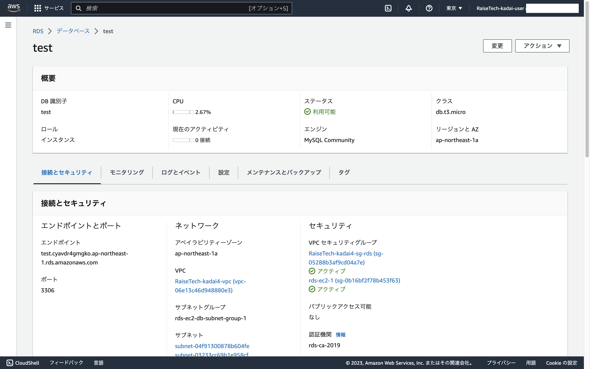

## VPC
---
*構成要素*
- VPC
- サブネット
- ルートテーブル
- IGW

VPC

* パブリックサブネット

  * ルートテーブル

* プライベートサブネット

  * ルートテーブル

* IGW
  

## EC2
---
*構成要素*
  - EC2
  - セキュリティグループ

EC2

* セキュリティグループ(インバウンド)

* セキュリティグループ(アウトバウンド)

## RDS
---
*構成要素*
  - RDS
  - セキュリティグループ

RDS

* セキュリティグループ(インバウンド)

* セキュリティグループ(アウトバウンド)  
  設定なし

## ローカルPCからEC2に接続
---

## EC2からRDSに接続
---

